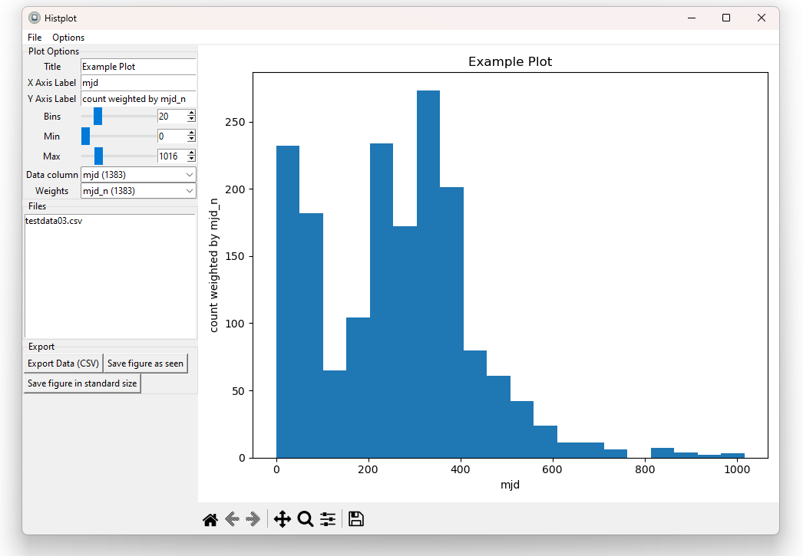

# Histplot


You want quickly to plot histograms of multiple files merged together? If you have this specific problem, then histplot is the solution. No programming required, only work on a simple GUI.
Features:
- Plot Histograms using the popular matplotlib
- Set mix, max and bins yourself or let them be autoset
- Merge multiple files into one plot
- If needed, weight by another column
- Export as CSV (comma seperated file) or figure
- Your preferences (title, labels, options) are autosaved in background

### Installation
You need to have python and pip installed. Type inside your console
```bash
pip install "https://raw.githubusercontent.com/andreasmz/histplot/main/dist/histplot-1.0.0-py3-none-any.whl"
```
To start it, run
```bash
python -m histplot
```
You can also create an shortcut on your desktop. For that, use the following syntax
```bash
[PATH TO YOU PYTHON EXECUTIVE] -m histplot
```


### Association

This software was developed for internal use at the AG Heine

### Gallery

<p align="center">
    
</p> 
